# Midgard

> The realm of humankind, where the will of the gods takes physical form.

  

*Image credit: [@norsemythologyclips](https://www.instagram.com/norsemythologyclips/) — go follow them.*

Embodied law for the Norse Architecture — **`Norse.Infrastructure`**: the concrete implementations of Asgard's contracts. The mediator runtime and its gRPC transport, the platform's trilingual wire (protobuf, JSON, and XML off one contract, described by one OpenAPI document), the identifier and enum wire law, the EF read layer, the migrations runner, the serialization seam, and app-wide theme composition all live here. In the dependency chain it rides on Asgard, Svartálfheim, Urðarbrunnr, and Naglfar; Yggdrasil and everything above rides on it.

## The dependency graph

Arrows point at the thing depended on. Solid edges are ordinary references; dashed edges are compile-time machinery — each wiring generator attaches as an analyzer to its `src` twin and ships inside that twin's package (`analyzers/dotnet/cs/`), never referenced or packed standalone, and the NORSE080 analyzer rides `Infrastructure.Web.Grpc`'s package the same way, reaching every realm compilation through `Directory.Analyzers.props`. Non-Norse packages (FluentUI, protobuf-net, EF Core, OpenTelemetry) are off the chart by convention.

```mermaid
flowchart BT
	subgraph Midgard["Midgard — Norse.Infrastructure"]
		ThemeFluentUI["Infrastructure.Components.Theme.FluentUI"]
		Theme["Infrastructure.Components.Theme"]
		WebServer["Infrastructure.Web.Server"]
		WebClient["Infrastructure.Web.Client"]
		WebGrpc["Infrastructure.Web.Grpc"]
		Backend["Infrastructure.Backend"]
		PersistenceEF["Infrastructure.Persistence.EntityFramework"]
		Migrations["Infrastructure.Migrations"]
		ServiceDefaultsAspNet["Infrastructure.ServiceDefaults.AspNet"]
		ServiceDefaults["Infrastructure.ServiceDefaults"]
		WebServerGen(["Infrastructure.Web.Server.Generator"])
		WebClientGen(["Infrastructure.Web.Client.Generator"])
		GrpcAnalyzers(["Infrastructure.Web.Grpc.Analyzers"])
	end
	subgraph Asgard["Asgard — Norse.Abstractions"]
		AWebServer["Abstractions.Web.Server"]
		AContracts["Abstractions.Contracts"]
		ABackend["Abstractions.Backend"]
		AMigrations["Abstractions.Migrations"]
		AEmit["Abstractions.Emit"]
	end
	subgraph Svartalfheim["Svartálfheim — Norse.Primitives"]
		Primitives["Primitives"]
	end
	subgraph Urdarbrunnr["Urðarbrunnr — Norse.Persistence"]
		UPersistenceEF["Persistence.EntityFramework"]
	end
	subgraph Naglfar["Naglfar — Norse.DesignSystem"]
		Tokens["DesignSystem.Tokens"]
	end
	ThemeFluentUI --> Theme
	Theme --> Tokens
	WebServer --> AWebServer
	WebServer --> Backend
	WebServer --> WebGrpc
	WebServer -. analyzer .-> WebServerGen
	WebClient --> AContracts
	WebClient --> WebGrpc
	WebClient -. analyzer .-> WebClientGen
	WebGrpc --> Primitives
	WebGrpc -. bundles .-> GrpcAnalyzers
	Backend --> ABackend
	Backend --> Primitives
	PersistenceEF --> ABackend
	PersistenceEF --> UPersistenceEF
	Migrations --> AMigrations
	ServiceDefaultsAspNet --> ServiceDefaults
	WebServerGen --> AEmit
	WebClientGen --> AEmit
```

Dependencies are transitive-first by house law — `Infrastructure.Web.Client` reaches `Primitives` through `Infrastructure.Web.Grpc`, so no direct edge exists. The `ServiceDefaults` pair is deliberately Norse-free (OpenTelemetry, health checks, and console logging only) — Aspire's ServiceDefaults convention, ruled into Midgard on 2026-06-28 rather than Yggdrasil or Bifröst. `Infrastructure.Web.Grpc.Generator.Shared` is shared source, not an assembly — its discovery walkers compile into both wiring generators.

## What's embodied here

- **The mediator runtime** ([`Infrastructure.Web.Server/Mediator`](src/Infrastructure.Web.Server/Mediator)) — `AddNorsePipeline()` composes the four behaviors (`Telemetry` → `ExceptionTranslation` → `Authorization` → `Validation`) around the handlers once, in DI, with a hand-rolled `Sender` folding `IEnumerable<IBehavior<,>>` — no MediatR, no package underneath at all. The gRPC transport is a three-interceptor stack in law order (`UnhandledExceptionInterceptor` → `PrincipalSeedingInterceptor` → `OutcomeServerInterceptor`), with [`Infrastructure.Web.Client`](src/Infrastructure.Web.Client)'s `OutcomeClientInterceptor` decoding the wire response back into `Outcome<T>` on the other end. Design: [the mediator pipeline retires the gateways](https://github.com/NorseArchitecture/Glitnir/blob/master/docs/Platform/specs/2026-07-27-mediator-pipeline-retires-gateway-design.md).
- **The trilingual wire** — one contract, three renderings, one document. [`Infrastructure.Web.Grpc`](src/Infrastructure.Web.Grpc) carries the shared wire law (`IdentifierSerializers`: CompatibilityLevel 300, identifiers as bare 16-byte RFC 9562 `bytes` fields, `SequentialGuid`/`DeterministicGuid` scalar serializers), guarded by NORSE080 (`Infrastructure.Web.Grpc.Analyzers`: no `RuntimeTypeModel` mutation outside the registration guard). The text channels live in [`Infrastructure.Web.Server`](src/Infrastructure.Web.Server): `Json/` (the `Result<T>` and enum-lexical converter families), `Xml/` (the formatters, `EnumLexical`, and the governed-name machinery behind the generated shapes), and `OpenApi/` (the schema transformers rendering the same laws into the document). Enums cross every channel by governed name, and per the [2026-08-09 flags amendment](https://github.com/NorseArchitecture/Glitnir/blob/master/docs/Platform/specs/2026-08-02-futhark-enum-wire-law-design.md) a `[Flags]` enum rides the contract bare while the channels translate: gRPC keeps the composed varint, JSON renders a governed-name array, XML renders repeated governed-name elements, OpenAPI stamps `type: array` over the same picklist. Writes decompose set bits in declaration order (composite members and leftover bits are illegal to write); reads OR-accumulate with did-you-mean suggestions on unknown tokens and honest `Duplicate` failures on repeated ones.
- **The generators** ([`gen/`](gen)) — one generator assembly per shipping package. [`Infrastructure.Web.Server.Generator`](gen/Infrastructure.Web.Server.Generator) emits `MapNorseGrpcServices()` and the server-side component wiring, and its `Xml/` subfolder is Futhark's XML shape generator: it walks facade-controller action closures — across the host compilation *and* the host's reference closure, so a realm's controller (Mímir's `CountriesController` was the first) emits its shapes into whatever host references it — enforces the shape law at build time (NORSE022–028, plus the closure guards NORSE035–037), and emits one `{Contract}XmlShape` class per contract. [`Infrastructure.Web.Client.Generator`](gen/Infrastructure.Web.Client.Generator) emits `AddNorseGrpcClients()` and the client component wiring.
- **The EF read layer** ([`Infrastructure.Persistence.EntityFramework`](src/Infrastructure.Persistence.EntityFramework)) — the well-and-wire read law embodied: the generic `Repository` closing `IReadRepository<TView>` per well entity, the promoted-member predicate rewriter, and `AddWell<TContext>` startup wiring with total-mirror validation. Vendor-family named — a document-store implementation lands as a sibling, never here.
- **The migrations runner** ([`Infrastructure.Migrations`](src/Infrastructure.Migrations)) — `MigrationRunnerService` and `AddNorseMigrationsRunner()`, the hosted service every Norse migrations service calls through: resolve every `IMigrationContributor`, run them, stop the host on success, throw hard on any failure.
- **The shared backend** ([`Infrastructure.Backend`](src/Infrastructure.Backend)) — the mirror of Asgard's `Abstractions.Backend`. `Serialization/` cages System.Text.Json behind the format-agnostic seam (per NORSE070, encodings live inside the wire border) and carries `MaskedValueJsonConverterFactory`, the defense that masks `IMaskedValue` members on every Midgard JSON path. `Keys/` carries the file-backed, dev-grade-only `DevelopmentSubjectKeyStore`.
- **Theme composition** ([`Infrastructure.Components.Theme`](src/Infrastructure.Components.Theme) / [`.Theme.FluentUI`](src/Infrastructure.Components.Theme.FluentUI)) — app-wide theme bootstrapping seeded from Naglfar's generated token package, in the platform's drop-in vendor pattern.

## Status

Everything above is live. The most recent wave (2026-08-09) landed the flags wire law across all three text channels, widened XML shape discovery to the host's reference closure, deleted NORSE029 (a flags member on a facade contract is now law, not a diagnostic), and consolidated the generators to one assembly per package. What remains unconverged is the dashboard-widget half of UI composition — and design happens first for it: brainstorm → spec → plan, recorded in Glitnir's [docs/Midgard/](https://github.com/NorseArchitecture/Glitnir/tree/master/docs/Midgard), before any further project is scaffolded here.

## The cosmos

Midgard is one realm of the [Norse Architecture](https://github.com/NorseArchitecture). The whole platform composes at [Bifröst](https://github.com/NorseArchitecture/Bifrost) — clone once, cross the bridge, and every session starts there so decisions get brainstormed across the entire landscape, not in isolation. Every design is tried in [Glitnir](https://github.com/NorseArchitecture/Glitnir), the design court, before code is forged here; this realm's specs and plans live in the court's [docs/Midgard/](https://github.com/NorseArchitecture/Glitnir/tree/master/docs/Midgard).

## Soundtrack: Guardians of Asgaard

